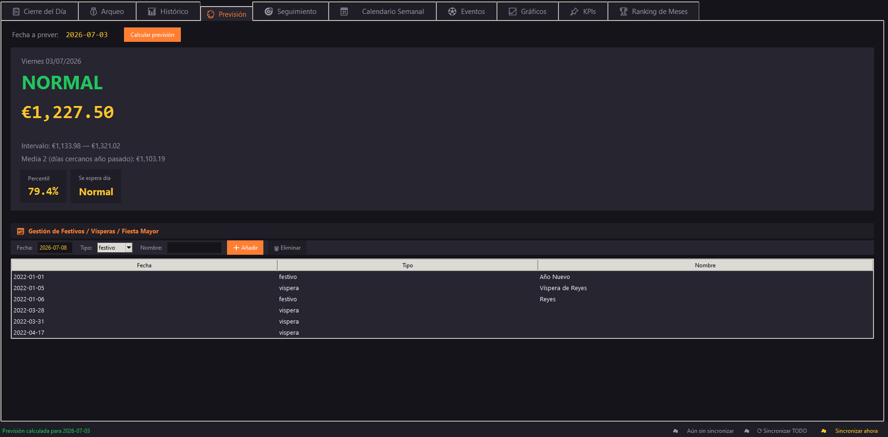
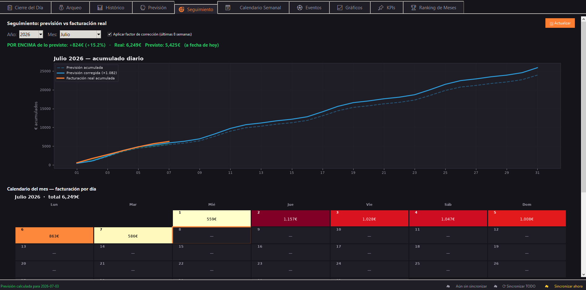
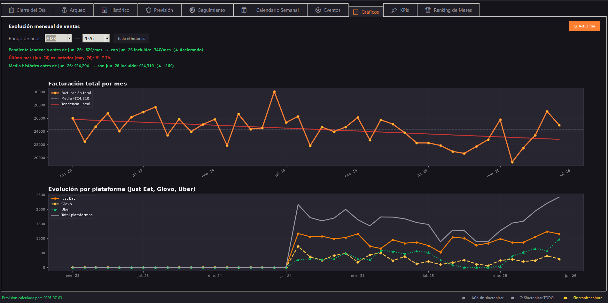
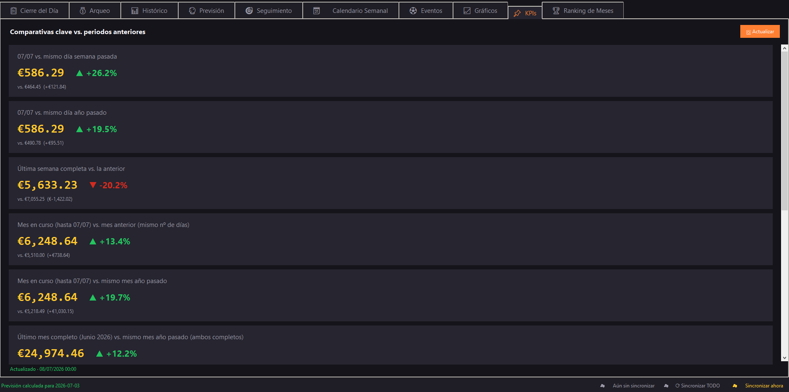
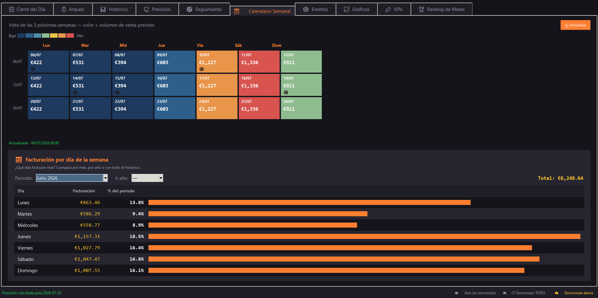
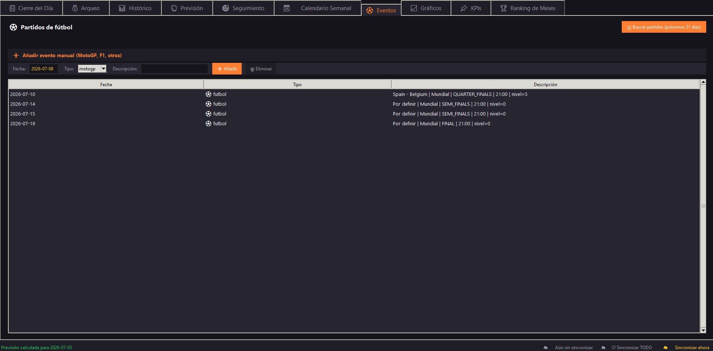

# Daily Close & Forecast

A desktop app I built to run the daily numbers of a restaurant: closing the till,
reconciling the cash count, keeping the sales history and forecasting how much each
day is likely to sell. I started it because the spreadsheets I was using kept falling
short — I wanted the day's close, the forecast and the follow-up all in one place,
pulling from a single database.

It's written in **Python (Tkinter)** for the interface and **PostgreSQL** for the data.

---

## What it does

**Daily close** — records the day's sales broken down by payment type (cash, card,
delivery platforms, etc.) and how much cash goes to the bank.

**Cash reconciliation** — counts notes and coins, with each day's opening balance
inherited from the previous close, and compares the cash actually counted against
what the day's takings say should be there. It flags any mismatch so you catch a
miscount the same day.

**Forecast** — estimates each day's sales from history, giving more weight to the
same period last year and adjusting by day type (weekday, weekend, holiday, eve of a
holiday). The forecast is corrected by a rolling factor so it stays close to how the
business is actually trending.

**Tracking** — compares forecast vs. actual sales across the month, so you can see
early whether you're above or below plan.

**History & ranking** — sales by day and by month, with month-to-month comparisons
and rankings.

**Charts & KPIs** — sales evolution and a handful of business indicators.

**Weekly calendar** — a week view with the forecast for each day.

**Events** — pulls key football fixtures (LaLiga, Champions League, World Cup, Euros)
from the [football-data.org](https://www.football-data.org/) API, because a big
midweek match noticeably changes an evening's sales in a delivery/takeaway business.

Optionally it can sync the closes to a cloud database (to check them from elsewhere)
and email a daily summary.

---

## Screenshots

**Forecast** — per-day sales estimate from history.


**Tracking** — forecast vs. actual across the month.


**Charts**


**KPIs**


**Weekly calendar**


**Events** — fixtures that can move an evening's sales.


---

## Tech notes

- **Language:** Python 3.10+
- **UI:** Tkinter (native desktop app)
- **Database:** PostgreSQL
- **Charts:** Matplotlib
- **External data:** football-data.org API (fixtures), requests + BeautifulSoup
- **Extras:** optional cloud sync and daily email summary (SMTP)

The forecasting logic is the interesting part: rather than a flat average, it weights
last year's same period more heavily, classifies each day by type, and applies a
rolling correction factor computed from recent forecast-vs-actual accuracy.

---

## Running it

Needs Python 3.10+ and a PostgreSQL database. Dependencies are in `requirements.txt`.

```bash
python -m venv venv
venv\Scripts\activate
pip install -r requirements.txt
copy .env.example .env
python app.py
```

Configuration (database, passwords, football API token, email) lives in a `.env`
file that is not committed. There's an `.env.example` template showing what to fill in.

---

## A note on this repo

This is an internal tool I built for my own use, so it assumes my way of working and
my own database schema. I'm publishing it to show the code and the approach, not as a
plug-and-play product. Without your own PostgreSQL database it will start but come up
empty. No credentials and no business data are included in the repository.
